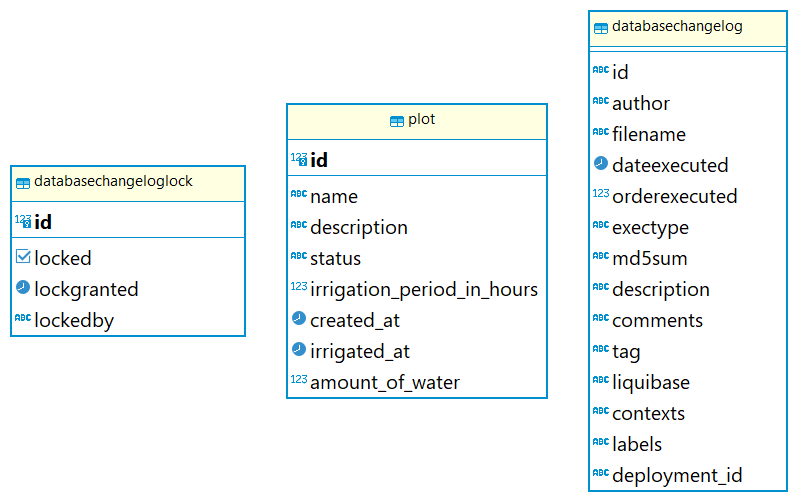
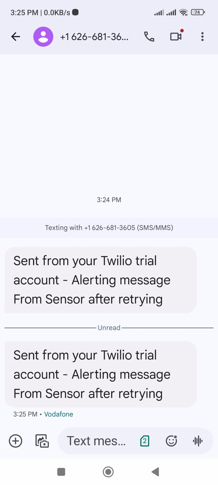

# <ins>Automatic Irrigation System</ins>

### **POC Description**

-----
Building an Irrigation System with the following tasks
- **Create Plot Of land.**
- **Configure a plot of land.**
- **Edit a plot of land.**
- **List all plots and it's details.**
- **Integration interface with the sensor device once a plot of land
  need to be irrigated.**
- **Update the status of the slot once the request is successfully sent
  to the sensor device.**
- **Retry calls to the sensor device in case the sensor not available
  (pre-configured.**
- **Alerting system to be implemented in case the sensor not
  available and after exceeding the retry times using Twilio.**

## Mocking Server As Sensor Integration
- A Simple server contains one API to integrate with the irrigation system
- It should be started before running the irrigation system
- go to the current directory containing **sensor-system.jar** file and try with this command
 `java -jar sensor-system.jar`
- you should have a database on your machine with the name **irrigation_system**
- this service requires a database user with **postgres** as a username and **12345** as a password so you need to create a user with these credentials.
- The sensor-system.jar is responsible for changing the status of plots and updating irrigation time slot to the current.
### Documentation For RESTful API Usage (Resources and Endpoints)

📧 https://documenter.getpostman.com/view/28448487/2sAYQgg7vq

### ⚙ Used Technologies ⚙

---
* Java version 17 from (**Eclipse Adoptium**)
* Spring Boot Version (3.3.2)
* Spring Data JPA
* Apache Maven version (**3.9.3**)
* Tomcat Server (Embedded Server)
* Spring Bean Validation
* JSON-B for Binding
* Postman to test APIs
* Postgresql Database
* Liquibase As Database Migration Tool
* Twilio For sending SMS
### 🛠 Work With Maven(software project management)

---
* Configure the pom.xml file
* Deploy the application using maven with spring-boot plugin and tomcat web container.

### Postgresql DataBase

---
* you need to create database with the name **irrigation_system** and adding the credentials into the **application.properties** file.
* Adding the configuration of datasource into the application.properties file (connection String, username, password, Driver)

------
Twilio SMS Example
- Used Twilio with Account SID, Auth Token, Virtual Twilio phone number for sending SMS messages.

------
- Try
  `mvn clean spring-boot:run` to run the main application.
------
### My  Accounts (LINKEDIN, HACKERRANK)

[LinkedIn Account](https://www.linkedin.com/in/abdallah96)

[HackerRank Account](https://www.hackerrank.com/profile/abdallahsameer22)

